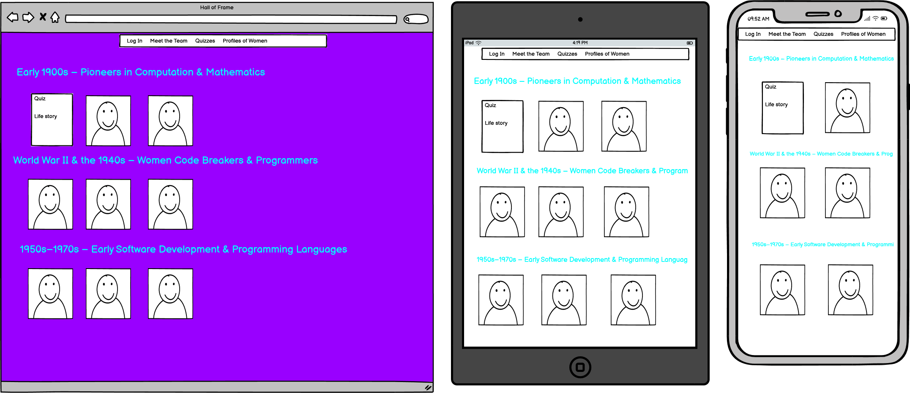

# team6

1. Purpose of the project
Our mission is to celebrate the incredible achievements of women in the tech industry throughout history by creating an engaging online Hall of Fame. Through interactive quizzes and small biographies, we aim to honor these pioneers, showcase their groundbreaking contributions, and inspire the world to learn more about their remarkable journeys. Dive in, have fun, and join us in spreading their stories far and wide!
2. user stories 
3. Features 
- Multiple-choice quizzes 
4. future features 
5. Typography and colour scheme 
Typography and colour scheme follows the 1980s, 1990s Windows design. 
- Design framework: 98.css 
6. Wireframes 

    
    
    
    

=== 1-6 for planning and then write code === 
8. technology 
 We used Django for this project. 
9. testing 
   8.1 code validation 
   8.2 test cases (user story based with screenshots) 
   8.3 fixed bugs 
   8.4 supported screens and browsers 
10. Deployment 
   9.1 via vs code 
   
   9.2 via github pages 
11. credits 
