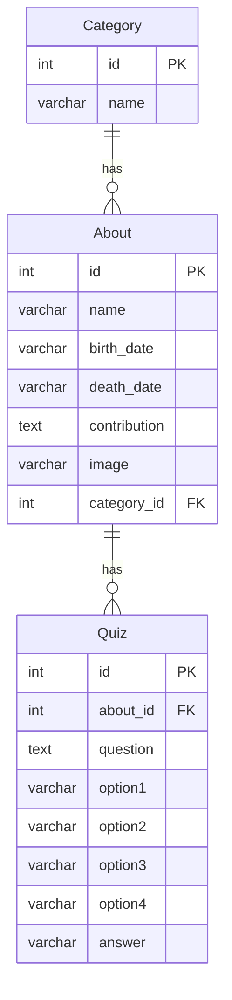
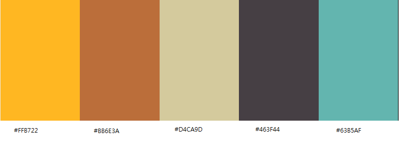

# team6

## Purpose of the project 
Our mission is to celebrate the incredible achievements of women in the tech industry throughout history by creating an engaging online Hall of Fame. Through interactive quizzes and small biographies, we aim to honor these pioneers, showcase their groundbreaking contributions, and inspire the world to learn more about their remarkable journeys. Dive in, have fun, and join us in spreading their stories far and wide!

## ERD
## Entity Relationship Diagram (ERD)

This ERD represents the relationships between the `Category`, `About`, and `Quiz` models.

## User stories 

## Features 
- Multiple-choice quizzes 
## Future features 
## Typography and colour scheme 
Typography and colour scheme follows the 1980s, 1990s Windows design. \

- Design framework: 98.css 
## Wireframes 

    
    
    
    

=== 1-6 for planning and then write code === 
## Technology 
 We used Django for this project. 
## Testing 
   ### 9.1 code validation 
   ### 9.2 test cases (user story based with screenshots) 
   ### 9.3 fixed bugs 
   ### 9.4 supported screens and browsers 
## Deployment 
   ### 10.1 via vs code 
   - First you need to make sure your repository is up to date, and you are in the right folder.
   - Type `python3 manage.py runserver` in Terminal.
   - CRTL + click on the http://127.0.0.1:8000/ , so you can run the app locally. (It will open in a separate window.)
   - CTRL + C to quit the server.
   ### 10.2 via Heroku 
## Credits 

### Meet The Team 
| Name | Github | LinkedIn |
|------|--------|----------|
| Katarina Kilian | https://github.com/kakilian | https://www.linkedin.com/in/katarina-kilian-645242313/ |
| Katalin Molnar | https://github.com/molnarlin | https://www.linkedin.com/in/katalin-molnar-b6a694165/ | 
| Dimitri Edel | https://github.com/dimitri-edel | https://www.linkedin.com/in/dimitri-edel-26a5022a9/ |
| Johnny | https://github.com/JohnnySonTrinh | https://www.linkedin.com/in/johnny-trinh-dev/ |
| Zalak | https://github.com/zalak786 | https://www.linkedin.com/in/zalak-shah-3a1429342/ |